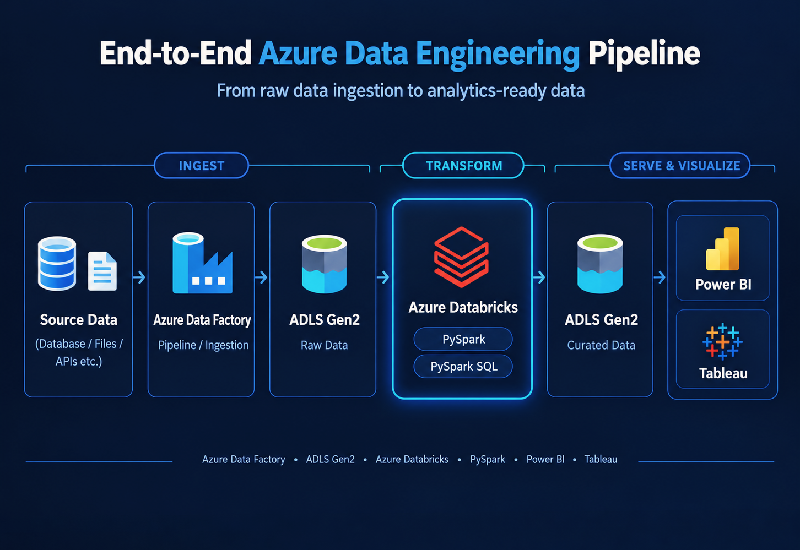

# 🚀 End-to-End Azure Data Engineering Project

An end-to-end Azure data engineering pipeline that ingests data from a database, stores it in Azure Data Lake Storage Gen2, transforms it using Azure Databricks with PySpark and PySpark SQL, and prepares the final curated data for visualization in Power BI or Tableau.

---

## 🏗️ Project Architecture

  

---

## 🔄 The Workflow

**Database → Azure Data Factory → ADLS Gen2 → Azure Databricks → PySpark / PySpark SQL → ADLS Gen2 → Power BI / Tableau**

### 1️⃣ Database — Source Data

The pipeline starts with data stored in a source database.

The database acts as the source for the data that needs to be ingested and prepared for analytics.

### 2️⃣ Azure Data Factory — Data Ingestion

**Azure Data Factory (ADF)** is used to create and orchestrate the data ingestion pipeline.

ADF extracts the data from the source database and moves it into Azure Data Lake Storage Gen2.

### 3️⃣ ADLS Gen2 — Raw Data

The ingested data is stored in **Azure Data Lake Storage Gen2** as raw data.

This provides a centralized and scalable storage layer before the transformation process.

### 4️⃣ Azure Databricks — Data Transformation

**Azure Databricks** is used to process and transform the raw data.

The transformation process uses:

- **PySpark**
- **PySpark SQL**

The data is cleaned, transformed, and prepared for downstream analytics.

### 5️⃣ ADLS Gen2 — Curated Data

After transformation, the final curated and analytics-ready data is stored back in **Azure Data Lake Storage Gen2**.

This data is now ready to be consumed by analytics and visualization tools.

### 6️⃣ Power BI / Tableau — Visualization

The final curated data can be used with **Power BI** or **Tableau** to create dashboards, reports, and visualizations.

---

## 🛠️ Technologies Used

| Technology | Purpose |
|---|---|
| **Azure Data Factory** | Data ingestion and pipeline orchestration |
| **Azure Data Lake Storage Gen2** | Raw and curated data storage |
| **Azure Databricks** | Data processing and transformation |
| **PySpark** | Distributed data processing |
| **PySpark SQL** | SQL-based data transformation |
| **Power BI** | Data visualization and reporting |
| **Tableau** | Data visualization and analytics |
| **Azure DevOps Git** | Source control and project management |

---

## 📊 End-to-End Data Flow

~~~text
                    ┌──────────────────┐
                    │     Database     │
                    │   Source Data    │
                    └────────┬─────────┘
                             │
                             ▼
                 ┌──────────────────────┐
                 │ Azure Data Factory   │
                 │                      │
                 │ Data Ingestion       │
                 │ Pipeline             │
                 └──────────┬───────────┘
                            │
                            ▼
                 ┌──────────────────────┐
                 │      ADLS Gen2       │
                 │                      │
                 │      Raw Data        │
                 └──────────┬───────────┘
                            │
                            ▼
                 ┌──────────────────────┐
                 │  Azure Databricks    │
                 │                      │
                 │  PySpark             │
                 │  PySpark SQL         │
                 │                      │
                 │ Data Transformation  │
                 └──────────┬───────────┘
                            │
                            ▼
                 ┌──────────────────────┐
                 │      ADLS Gen2       │
                 │                      │
                 │   Curated Data       │
                 │   Final Data         │
                 └──────────┬───────────┘
                            │
                            ▼
                 ┌──────────────────────┐
                 │  Power BI / Tableau  │
                 │                      │
                 │   Visualization      │
                 │   & Analytics        │
                 └──────────────────────┘
~~~

---

## 📁 Repository Structure

~~~text
Azure-End-To-End-Data-Engineering-Project/
│
├── dataset/
│   └── Azure Data Factory datasets
│
├── linkedService/
│   └── Azure Data Factory linked services
│
├── pipeline/
│   └── Data ingestion pipeline
│
├── README.md
│
└── azure_project.png
~~~

---

## 🔧 Azure Data Factory

This project uses **Azure Data Factory** to orchestrate the data ingestion process.

The ADF project is connected to **Azure DevOps Git**, allowing the Data Factory configuration to be version-controlled.

The repository contains the main ADF project components:

- Datasets
- Linked Services
- Pipelines
- Project documentation
- Project configuration

---

## 🗄️ Data Lake Architecture

The data moves through two main stages in ADLS Gen2:

### Raw Layer

The raw data received from the source database is stored in ADLS Gen2 before transformation.

~~~text
Source Database
      ↓
Azure Data Factory
      ↓
ADLS Gen2
      ↓
Raw Data
~~~

### Curated Layer

After processing in Azure Databricks, the transformed data is stored back in ADLS Gen2.

~~~text
Raw Data
   ↓
Azure Databricks
   ↓
PySpark / PySpark SQL
   ↓
ADLS Gen2
   ↓
Curated / Final Data
~~~

---

## ⚙️ Data Transformation

Azure Databricks is used as the transformation layer.

The project uses **PySpark** and **PySpark SQL** to process the raw data and produce a clean, structured, analytics-ready dataset.

The transformation layer can be used for tasks such as:

- Data cleaning
- Data type transformations
- Filtering
- Aggregations
- Data preparation
- SQL-based transformations
- Preparing datasets for analytics

---

## 🔗 Git Integration

The Azure Data Factory project is integrated with Git for source control.

The repository structure is maintained through Azure Data Factory's Git integration.

~~~text
Azure Data Factory
        ↓
    Git Integration
        ↓
Azure DevOps Repository
        ↓
 ┌───────────────┐
 │ dataset/      │
 │ linkedService/│
 │ pipeline/     │
 │ README.md     │
 └───────────────┘
~~~

This provides version control and makes it easier to manage changes to the ADF project.

---

## 🎯 Project Objective

The main objective of this project is to demonstrate an end-to-end cloud data engineering workflow using Microsoft Azure.

The pipeline covers the complete journey of data:

**Ingestion → Storage → Transformation → Curated Storage → Visualization**

---

## 💡 Key Skills Demonstrated

- Azure Data Factory
- Data pipeline development
- Data ingestion
- Azure Data Lake Storage Gen2
- Cloud data storage
- Azure Databricks
- PySpark
- PySpark SQL
- Data transformation
- ETL / ELT concepts
- Raw and curated data layers
- Azure DevOps Git integration
- Analytics-ready data preparation
- Power BI / Tableau integration

---

## 📌 Project Summary

This project demonstrates how multiple Azure services can work together to build a complete data engineering pipeline.

The overall architecture is:

~~~text
Database
    ↓
Azure Data Factory
    ↓
ADLS Gen2 — Raw Data
    ↓
Azure Databricks
    ↓
PySpark / PySpark SQL
    ↓
ADLS Gen2 — Curated Data
    ↓
Power BI / Tableau
~~~

The final result is a structured and analytics-ready dataset that can be consumed by business intelligence and visualization platforms.

---

## 👨‍💻 Author

**Moiz Waheed**

Data Engineering Project

---

## 🔗 Project Repository

[Azure End-to-End Data Engineering Project](https://github.com/MoizWaheed80/Azure-End-To-End-Data-Engineering-Project)

---

## 🧰 Tech Stack

**Azure Data Factory** • **ADLS Gen2** • **Azure Databricks** • **PySpark** • **PySpark SQL** • **Power BI** • **Tableau** • **Azure DevOps Git**
